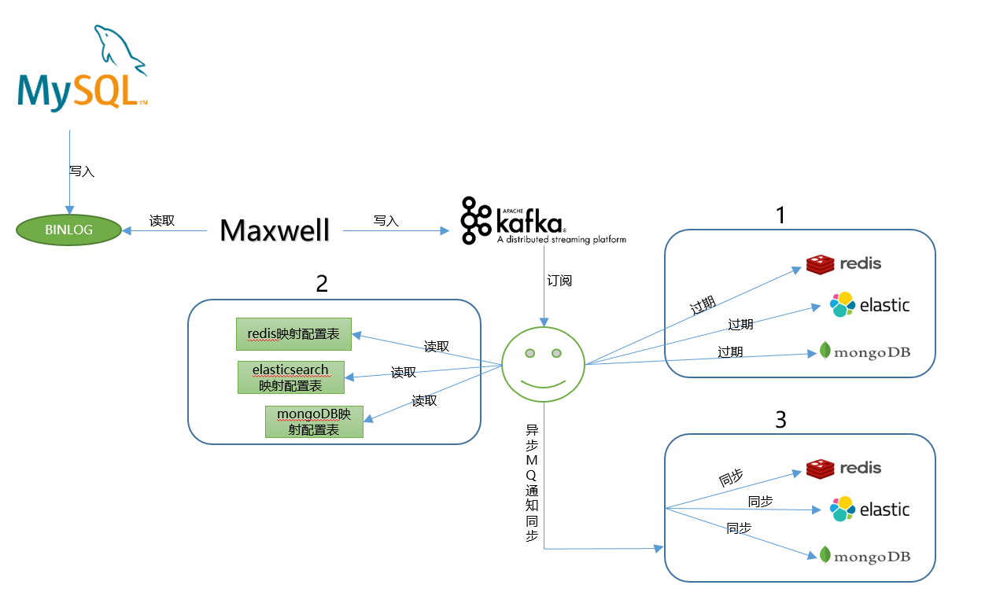

## maxwell-kafka-enjoy

> **maxwell客户端**，提供redis缓存失效，elasticsearch，mongodb数据同步功能。
---
#### 简介

---

#### 依赖
* jdk1.8
* maxwell-1.22.1
* mysql5.7.26
* kafka_2.11-2.0.0

redis、elasticsearch、MongoDB等非必须，如果需要使用功能需搭建对应依赖

#### maxwell消息格式
>{"database":"test","table":"sys_order","type":"update","ts":1559640375,"xid":2012,"commit":true,"data":{"id":1,"order_code":"1","category":0,"goods_name":"牙膏","is_send_express":1,"is_del":0,"gmt_create":"2019-06-04 17:21:45","gmt_modify":"2019-06-04 17:26:15"},"old":{"is_send_express":0,"gmt_modify":"2019-06-04 17:25:25"}}

http://localhost:8082/swagger-ui.html#/