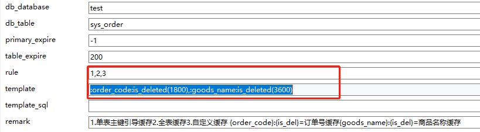
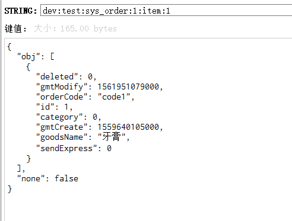
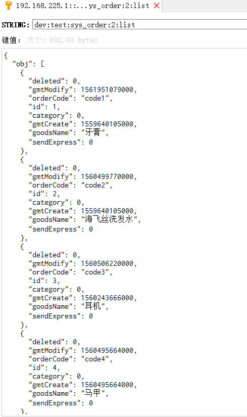
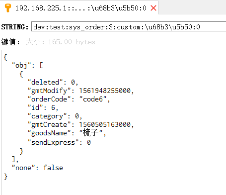
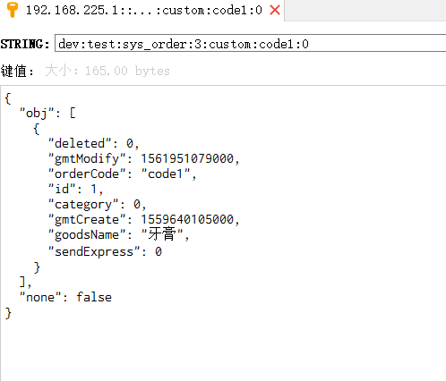

#### **maxwell消费者**，提供mysql数据全量及增量同步至redis。

#### 依赖
* jdk1.8
* maxwell-1.22.1
* mysql5.7.26
* kafka_2.11-2.0.0
* redis4.0
* elasticsearch(非必须)

----
后面考虑内置maxwell，maxwell不需独立部署
#### 快速开始
一. 启动mysql服务
> service mysqld start
### 
``` mysql配置参考
datadir=/var/lib/mysql
socket=/var/lib/mysql/mysql.sock
# Disabling symbolic-links is recommended to prevent assorted security risks
symbolic-links=0
log-error=/var/log/mysqld.log
pid-file=/var/run/mysqld/mysqld.pid
bind-address =0.0.0.0
server-id=1
log-bin=master
binlog_format=row
wait_timeout=31536000
interactive_timeout=31536000
sql_mode=STRICT_TRANS_TABLES,NO_ZERO_IN_DATE,NO_ZERO_DATE,ERROR_FOR_DIVISION_BY_ZERO,NO_AUTO_CREATE_USER,NO_ENGINE_SUBSTITUTION
```
二. 启动zookeeper(kafka依赖,当然你也可以用kafka内置的，取决于怎样配置kafka)

> bin/zkServer.sh start &
``` zoo.cfg配置
tickTime=2000
initLimit=10
syncLimit=5
dataDir=/opt/pkg/java/zookeeper/zookeeper-3.4.13/data
logDir=/opt/pkg/java/zookeeper/zookeeper-3.4.13/log
clientPort=2181
```

三. 启动kafka

> bin/kafka-server-start.sh config/server.properties &
``` server.properties 配置
broker.id=0
dataDir=/opt/pkg/java/kafka_2.11-2.0.0/data
clientPort=9092
listeners=PLAINTEXT://192.168.225.1:9092
num.network.threads=3
num.io.threads=8
socket.send.buffer.bytes=102400
socket.receive.buffer.bytes=102400
socket.request.max.bytes=104857600
num.partitions=1
num.recovery.threads.per.data.dir=1
offsets.topic.replication.factor=1
transaction.state.log.replication.factor=1
transaction.state.log.min.isr=1
log.retention.hours=168
log.segment.bytes=1073741824
log.retention.check.interval.ms=300000
zookeeper.connect=192.168.225.1:2181
zookeeper.connection.timeout.ms=6000
```

四. 启动maxwell

> bin/maxwell --config=../config.properties --producer=kafka --kafka.bootstrap.servers=192.168.225.1:9092 --kafka_topic=maxwell &
``` config.properties 配置
log_level=info
producer=kafka
kafka.bootstrap.servers=192.168.225.1:9092
host=192.168.225.1
user=maxwell
password=maxwell
kafka.compression.type=snappy
kafka.retries=0
kafka.acks=1
metrics_type=jmx,slf4j,http
metrics_slf4j_interval=60
http_port=8222
http_path_prefix=/maxwell
```
五. 启动redis
> ./redis-server ../redis.conf
``` redis.conf配置
bind 0.0.0.0
protected-mode no
port 6379
tcp-backlog 511
timeout 0
tcp-keepalive 300
daemonize no
supervised no
pidfile /var/run/redis_6379.pid
loglevel notice
logfile ""
databases 16
always-show-logo yes
save 900 1
save 300 10
save 60 10000
stop-writes-on-bgsave-error yes
rdbcompression yes
rdbchecksum yes
dbfilename dump.rdb
dir ./
slave-serve-stale-data yes
slave-read-only yes
repl-diskless-sync no
repl-diskless-sync-delay 5
repl-disable-tcp-nodelay no
requirepass foobared
lazyfree-lazy-eviction no
lazyfree-lazy-expire no
lazyfree-lazy-server-del no
slave-lazy-flush no
appendonly no
appendfilename "appendonly.aof"
yre, use "everysec".
appendfsync everysec
no-appendfsync-on-rewrite no
auto-aof-rewrite-percentage 100
auto-aof-rewrite-min-size 64mb
aof-load-truncated yes
aof-use-rdb-preamble no
lua-time-limit 5000
yvalue of zero forces the logging of every command.
slowlog-log-slower-than 10000
slowlog-max-len 128
latency-monitor-threshold 0
notify-keyspace-events ""
yeshold. These thresholds can be configured using the following directives.
hash-max-ziplist-entries 512
hash-max-ziplist-value 64
list-max-ziplist-size -2
list-compress-depth 0
y in order to use this special memory saving encoding.
set-max-intset-entries 512
zset-max-ziplist-entries 128
zset-max-ziplist-value 64
hll-sparse-max-bytes 3000
activerehashing yes
client-output-buffer-limit normal 0 0 0
client-output-buffer-limit slave 256mb 64mb 60
client-output-buffer-limit pubsub 32mb 8mb 60
```
六. 初始化db脚本
> [init.sql](./sql/init.sql)
```
use maxwell;
CREATE TABLE `dynamic_datasource` (
  `id` bigint(20) NOT NULL AUTO_INCREMENT,
  `db_database` varchar(50) NOT NULL COMMENT 'database name',
  `pool_name` varchar(255) NOT NULL DEFAULT 'com.zaxxer.hikari.HikariDataSource' COMMENT 'com.zaxxer.hikari.HikariDataSource',
  `pool_config` text COMMENT '连接池的json配置',
  `driver_class_name` varchar(50) NOT NULL DEFAULT 'com.mysql.jdbc.Driver' COMMENT '驱动',
  `url` varchar(255) NOT NULL COMMENT 'jdbc url',
  `username` varchar(50) NOT NULL COMMENT '用户名',
  `password` varchar(50) NOT NULL COMMENT '密码',
  `jndi_name` varchar(50) DEFAULT NULL,
  `is_enable` tinyint(1) NOT NULL DEFAULT '0' COMMENT '0:启用  1:禁用',
  `is_deleted` tinyint(1) NOT NULL DEFAULT '0' COMMENT '0:保留 1:删除',
  `gmt_create` datetime DEFAULT NULL COMMENT 'now()',
  `gmt_modify` datetime DEFAULT NULL ON UPDATE CURRENT_TIMESTAMP,
  `create_by` varchar(50) NOT NULL,
  `modify_by` varchar(50) NOT NULL,
  PRIMARY KEY (`id`),
  UNIQUE KEY `uk_database_name` (`db_database`) USING BTREE
) ENGINE=InnoDB AUTO_INCREMENT=3 DEFAULT CHARSET=utf8 COMMENT='动态数据源配置表';

CREATE TABLE `redis_mapping` (
  `id` bigint(20) NOT NULL AUTO_INCREMENT COMMENT 'id',
  `db_database` varchar(255) NOT NULL DEFAULT '0' COMMENT '数据库',
  `db_table` varchar(255) NOT NULL DEFAULT '0' COMMENT '表',
  `primary_expire` bigint(18) DEFAULT '-1' COMMENT '主键缓存过期时间，默认永不过期',
  `table_expire` bigint(18) DEFAULT '-1' COMMENT '全表缓存过期时间, 默认-1永不过期, 单位：秒',
  `rule` varchar(255) DEFAULT '0' COMMENT ' 缓存生成规则,可以配置多个,多个使用,分割, 1,2 ... 1,3 ...  1,2,3\r\n 默认0.无缓存\r\n 1.单表主键引导缓存\r\n 2.全表缓存\r\n 3.自定义缓存\r\n',
  `template` varchar(1024) DEFAULT '0' COMMENT '当rule包含3时,template, template ,分割\r\n 自定义缓存模板\r\n 默认0.无模板\r\n字段1:字段2:字段3(过期时间)\r\n字段1:字段2:字段3,字段1:字段2(过期时间)\r\n 字段必须是table里对应的数据库字段,否则无法映射成功\r\n',
  `template_sql` varchar(1024) DEFAULT NULL COMMENT '自定义模板对应sql,分割\r\n与template一一对应',
  `remark` varchar(1024) DEFAULT '' COMMENT '备注',
  `is_enable` tinyint(1) DEFAULT '0' COMMENT '0:启用 1:禁用',
  `is_deleted` tinyint(1) DEFAULT '0' COMMENT '0:保留 1:删除',
  `gmt_create` datetime NOT NULL DEFAULT CURRENT_TIMESTAMP COMMENT '创建时间',
  `gmt_modify` datetime NOT NULL DEFAULT CURRENT_TIMESTAMP ON UPDATE CURRENT_TIMESTAMP COMMENT '修改时间',
  `create_by` varchar(255) DEFAULT '0' COMMENT '创建人',
  `modify_by` varchar(255) DEFAULT '0' COMMENT '修改人',
  PRIMARY KEY (`id`),
  UNIQUE KEY `uk_db_database_db_table` (`db_database`,`db_table`) USING BTREE
) ENGINE=InnoDB AUTO_INCREMENT=1 DEFAULT CHARSET=utf8 COMMENT='redis和数据库表映射关系';

CREATE TABLE `elasticsearch_mapping` (
  `id` bigint(20) NOT NULL AUTO_INCREMENT COMMENT 'id',
  `db_database` varchar(255) NOT NULL DEFAULT '0' COMMENT '数据库',
  `db_table` varchar(255) NOT NULL DEFAULT '0' COMMENT '表',
  `remark` varchar(1024) DEFAULT '' COMMENT '备注',
  `is_enable` tinyint(1) DEFAULT '0' COMMENT '0:启用 1:禁用',
  `is_deleted` tinyint(1) DEFAULT '0' COMMENT '0:保留 1:删除',
  `gmt_create` datetime NOT NULL DEFAULT CURRENT_TIMESTAMP COMMENT '创建时间',
  `gmt_modify` datetime NOT NULL DEFAULT CURRENT_TIMESTAMP ON UPDATE CURRENT_TIMESTAMP COMMENT '修改时间',
  `create_by` varchar(255) DEFAULT '0' COMMENT '创建人',
  `modify_by` varchar(255) DEFAULT '0' COMMENT '修改人',
  PRIMARY KEY (`id`),
  UNIQUE KEY `uk_db_database_db_table` (`db_database`,`db_table`) USING BTREE
) ENGINE=InnoDB DEFAULT CHARSET=utf8 COMMENT='es数据库表映射关系';

-- 测试初始化配置test数据库
INSERT INTO `maxwell`.`dynamic_datasource` (`id`, `db_database`, `pool_name`, `pool_config`, `driver_class_name`, `url`, `username`, `password`, `jndi_name`, `is_enable`, `is_deleted`, `gmt_create`, `gmt_modify`, `create_by`, `modify_by`) VALUES ('1', 'master', 'com.zaxxer.hikari.HikariDataSource', '{\"minIdle\":5,\"maxPoolSize\":15,\"isAutoCommit\":true,\"idleTimeout\":30000,\"maxLifetime\":1800000,\"connectionTimeout\":30000,\"connectionTestQuery\":\"SELECT 1\"}', 'com.mysql.jdbc.Driver', 'jdbc:mysql://192.168.225.1:3306/maxwell?useUnicode=true&characterEncoding=UTF8&useSSL=false&allowMultiQueries=true&autoReconnect=true&failOverReadOnly=false&maxReconnects=10&tinyInt1isBit=false', 'root', 'root', NULL, '0', '0', now(), now(), '110', '110');
INSERT INTO `maxwell`.`dynamic_datasource` (`id`, `db_database`, `pool_name`, `pool_config`, `driver_class_name`, `url`, `username`, `password`, `jndi_name`, `is_enable`, `is_deleted`, `gmt_create`, `gmt_modify`, `create_by`, `modify_by`) VALUES ('2', 'test', 'com.zaxxer.hikari.HikariDataSource', '{\"minIdle\":5,\"maxPoolSize\":15,\"isAutoCommit\":true,\"idleTimeout\":30000,\"maxLifetime\":1800000,\"connectionTimeout\":30000,\"connectionTestQuery\":\"SELECT 1\"}', 'com.mysql.jdbc.Driver', 'jdbc:mysql://192.168.225.1:3306/test?useUnicode=true&characterEncoding=UTF8&useSSL=false&allowMultiQueries=true&autoReconnect=true&failOverReadOnly=false&maxReconnects=10&tinyInt1isBit=false', 'root', 'root', NULL, '0', '0', now(), now(), '110', '110');
-- 测试test数据库下sys_order表进行redis缓存同步
INSERT INTO `maxwell`.`redis_mapping` (`id`, `db_database`, `db_table`, `primary_expire`, `table_expire`, `rule`, `template`, `template_sql`, `remark`, `is_enable`, `is_deleted`, `gmt_create`, `gmt_modify`, `create_by`, `modify_by`) VALUES ('1', 'test', 'sys_order', '-1', '200', '1,2,3', ':order_code:is_deleted(1800),:goods_name:is_deleted(3600)', NULL, '1.单表主键引导缓存\n2.全表缓存\n3.自定义缓存 {order_code}:{is_del}=订单号缓存{goods_name}:{is_del}=商品名称缓存  ', '0', '0', now(), now(), '0', '0');
-- 创建test数据库
CREATE DATABASE `test` CHARACTER SET utf8 COLLATE utf8_general_ci;
use test;

-- 创建test数据库下sys_order测试表
CREATE TABLE `sys_order` (
  `id` bigint(10) NOT NULL AUTO_INCREMENT COMMENT '主键',
  `order_code` varchar(255) NOT NULL DEFAULT '0' COMMENT '订单号',
  `category` smallint(1) NOT NULL DEFAULT '0' COMMENT '0/正常订单,1/促销订单',
  `goods_name` varchar(255) NOT NULL DEFAULT '0' COMMENT '商品名称',
  `is_send_express` tinyint(1) NOT NULL DEFAULT '0' COMMENT '是否发货0/未 ,1/已发货',
  `is_deleted` tinyint(1) NOT NULL DEFAULT '0' COMMENT '0/保留,1/删除',
  `gmt_create` datetime NOT NULL DEFAULT CURRENT_TIMESTAMP COMMENT '创建时间',
  `gmt_modify` datetime NOT NULL DEFAULT CURRENT_TIMESTAMP ON UPDATE CURRENT_TIMESTAMP COMMENT '修改时间',
  PRIMARY KEY (`id`),
  UNIQUE KEY `unique_code_idx` (`order_code`) USING BTREE
) ENGINE=InnoDB AUTO_INCREMENT=1 DEFAULT CHARSET=utf8;

-- 初始化测试数据
INSERT INTO `test`.`sys_order` (`id`, `order_code`, `category`, `goods_name`, `is_send_express`, `is_deleted`, `gmt_create`, `gmt_modify`) VALUES ('1', 'code1', '0', '牙膏', '0', '0', now(), now());
INSERT INTO `test`.`sys_order` (`id`, `order_code`, `category`, `goods_name`, `is_send_express`, `is_deleted`, `gmt_create`, `gmt_modify`) VALUES ('2', 'code2', '0', '海飞丝洗发水', '0', '0',  now(), now());
INSERT INTO `test`.`sys_order` (`id`, `order_code`, `category`, `goods_name`, `is_send_express`, `is_deleted`, `gmt_create`, `gmt_modify`) VALUES ('3', 'code3', '0', '耳机', '0', '0',  now(), now());
INSERT INTO `test`.`sys_order` (`id`, `order_code`, `category`, `goods_name`, `is_send_express`, `is_deleted`, `gmt_create`, `gmt_modify`) VALUES ('4', 'code4', '0', '马甲', '0', '0',  now(), now());
INSERT INTO `test`.`sys_order` (`id`, `order_code`, `category`, `goods_name`, `is_send_express`, `is_deleted`, `gmt_create`, `gmt_modify`) VALUES ('5', 'code5', '0', '法海', '0', '0',  now(), now());
INSERT INTO `test`.`sys_order` (`id`, `order_code`, `category`, `goods_name`, `is_send_express`, `is_deleted`, `gmt_create`, `gmt_modify`) VALUES ('6', 'code6', '0', '梳子', '0', '0',  now(), now());
```
七. 启动maxwell-kafka-enjoy工程

#### 全量数据同步缓存
在maxwell服务下，执行
```
./maxwell-bootstrap --config=../config.properties --host 192.168.225.1 --port 3306  --user root --password root --database test --table sys_order --log_level debug --client_id maxwell
```
#### 全量数据同步结果
>基于对sys_order表映射的redis规则配置
 

输出：
<br/>
sys_order表对应所有redis键值

<br/>
sys_order表对应主键缓存

<br/>
sys_order表对应全表缓存

<br/>
sys_order表对应自定义缓存缓存(按照商品名称)

<br/>
sys_order表对应自定义缓存缓存(按照编号)


#### 增量数据同步结果

> 增量数据同步，会根据redis_mapping配置缓存模板信息进行增量同步

