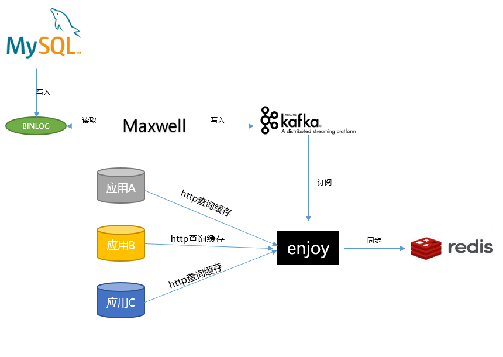

#### **maxwell消费者**，提供mysql数据全量及增量同步至redis。

#### 依赖
* jdk1.8
* maxwell-1.22.1
* mysql5.7.26
* kafka_2.11-2.0.0
* redis4.0

----


后面考虑内置maxwell，maxwell不需独立部署
#### 快速开始
一. 启动mysql服务
> service mysqld start
[my.cnf参考配置](./docs/my.cnf)

二. 启动zookeeper(kafka依赖,当然你也可以用kafka内置的，取决于怎样配置kafka)
> bin/zkServer.sh start &
[zoo.cfg参考配置](./docs/zoo.cfg)

三. 启动kafka
> bin/kafka-server-start.sh config/server.properties &
[server.properties参考配置](./docs/server.properties)

四. 启动maxwell
> bin/maxwell --config=../config.properties --producer=kafka --kafka.bootstrap.servers=192.168.225.1:9092 --kafka_topic=maxwell &
[config.properties参考配置](./docs/config.properties)

五. 启动redis
> ./redis-server ../redis.conf
[redis.conf参考配置](./docs/redis.conf)

六. 初始化db脚本
> [init.sql](./sql/init.sql)

七. 启动maxwell-kafka-enjoy工程

#### 全量数据同步缓存
在maxwell服务下，执行
```
./maxwell-bootstrap --config=../config.properties --host 192.168.225.1 --port 3306  --user root --password root --database test --table sys_order --log_level debug --client_id maxwell
```


#### 增量数据同步

> 增量数据同步，会根据redis_mapping配置缓存模板信息进行增量同步

